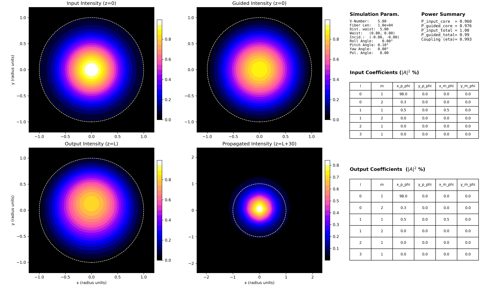

# Optical Fiber LP Mode Projection & Propagation

This project simulates the coupling of a tilted, elliptical Gaussian beam into a step-index optical fiber, the phase evolution of the signal through the fiber, and its subsequent diffraction into free space.

It integrates three distinct physical stages:

1. **Coupling:** Decomposition of the input field into Linearly Polarized (LP) fiber modes.
2. **Fiber Transit:** Independent phase evolution of each excited mode.
3. **Free Space Diffraction:** Propagation of the output field using the Angular Spectrum Method (ASM) with aliasing control.

## Core Physics

The simulation assumes the **weakly-guiding approximation** ($n_{core} \approx n_{clad}$) for a step-index fiber.

### 1. Modal Decomposition (Coupling)
The code first solves the scalar Helmholtz equation to find the transverse field profiles of the guided $LP_{lm}$ modes. The input field $\mathbf{E}_{in}$ (a tilted Gaussian beam) is projected onto this orthonormal basis to find the complex coupling coefficients $c_{lm}$:

$$c_{lm}(z=0) = \iint \mathbf{E}_{\text{in}} \cdot \mathbf{E}_{lm}^* \, dA$$

Since the modes are normalized such that $\iint |\mathbf{E}_{lm}|^2 \, dA = 1$, the squared modulus $|c_{lm}|^2$ represents the power coupled into each specific mode.

### 2. Fiber Propagation
Once coupled, the field propagates through a fiber of length $L$. Each mode $LP_{lm}$ has a distinct propagation constant $\beta_{lm}$ derived from the characteristic equation. The coefficients evolve as:

$$c_{lm}(L) = c_{lm}(0) \cdot e^{-j \beta_{lm} L}$$

where $\beta_{lm} = \sqrt{(n_{core}k_0)^2 - (u_{lm}/a)^2}$. This phase slippage between modes causes the spatial intensity profile to change along the fiber (intermodal interference), even though the power distribution among modes remains constant (assuming no losses).

### 3. Free Space Propagation (ASM)
The field exiting the fiber, $\mathbf{E}_{out}$, acts as the source for diffraction into free space. The simulation employs the **Angular Spectrum Method (ASM)**, a scalar diffraction technique based on Fourier analysis.

**The Algorithm:**
1.  **Spectral Decomposition (FFT):** The spatial field $E(x,y,0)$ is decomposed into plane waves:
    $$A(k_x, k_y; 0) = \mathcal{F}\{E(x,y,0)\}$$
2.  **Propagation in k-space:** The phase shift transfer function $H(k_x, k_y)$ is applied:
    $$A(k_x, k_y; z) = A(k_x, k_y; 0) \cdot e^{j k_z z}$$
    where $k_z = \sqrt{k_0^2 - k_x^2 - k_y^2}$.
3.  **Reconstruction (IFFT):** The propagated field is recovered via Inverse FFT.

**Aliasing Control:**
The code (`free_propagate_asm_scalar_aliasing_robust`) implements a padding strategy. Since the beam diverges ($\theta \propto \lambda/w_0$), high spatial frequencies can wrap around the FFT grid. The simulation automatically expands the computational grid based on the Numerical Aperture (NA) and propagation distance to prevent these numerical artifacts.

## File Structure

* **`LP_projection.py`**: The main entry point. Defines physical parameters, runs the simulation pipeline, and triggers visualization.
* **`source/`**:
  * **`LP_projection_functions.py`**: Contains solvers for fiber modes (root finding for characteristic equations), tilted Gaussian beam generation (Euler angles), and overlap integrals.
  * **`propagation.py`**: Contains the propagation engines:
    * `fiber_propagation`: Applies $\beta_{lm}$ phase factors using Pandas for data handling.
    * `free_propagate_asm_scalar...`: Implements the FFT-based Angular Spectrum Method with automatic padding.
  * **`graph.py`**: Dedicated plotting library for generating the summary dashboard.

## Dependencies

* **numpy**: Array manipulations and FFT operations.
* **scipy**: Bessel functions (`jv`, `kn`) and root finding (`root_scalar`).
* **matplotlib**: Visualization and plotting.
* **pandas**: Data structures for managing mode coefficients efficiently.


## How to Use

1.  Ensure you have the required dependencies installed.
2.  Configure the simulation parameters in the `PARAMETERS` section of `LP_projection.py`.
3.  Run the main script from your terminal:
    ```bash
    python LP_projection.py
    ```

### Key Parameters (in `LP_projection.py`)
---
**Note:** All length parameters (waist, offset, wavelength, etc.) are specified in **units of fiber core radii**.

* `FIBER_V`: The normalized frequency (V-number) of the fiber.
* `MODES_TO_TEST`: A list of `(l, m)` tuples specifying which LP modes to include in the basis.
* `FIBER_LENGTH`: Length of the fiber, used to calculate relative phases at fiber end face.
* `DIST_FROM_FIBER`: DDistance from the fiber end face at which the diffracted field is calculated.
* `LAMBDA`: Wavelength of the injected beam.
* `DIST_TO_WAIST`: Distance from the beam waist to the fiber input plane.
* `W0_X`, `W0_Y`: Beam waist radii along x and y.
* `X0`, `Y0`: Beam's incidence point (offset) on the fiber plane.
* `ROLL_ANGLE`, `PITCH_ANGLE`, `YAW_ANGLE`: Euler angles (in radians) to define the beam's tilt.
* `GRID_SIZE`: The resolution of the simulation grid (e.g., 500 for a 500x500 grid).


## Output

The script creates an `output/` directory containing `summary_figure.png` (auto-incremented filename), displaying the intensity profiles and coupling tables.

Below is an example of the simulation output (`summary_figure_2.jpg`), showing the input Gaussian beam, the excited modes inside the fiber, the output field after propagation, and the diffracted field in free space.



